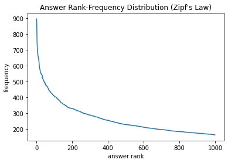
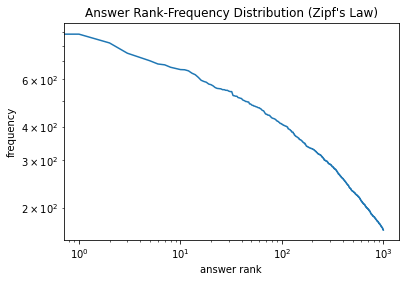
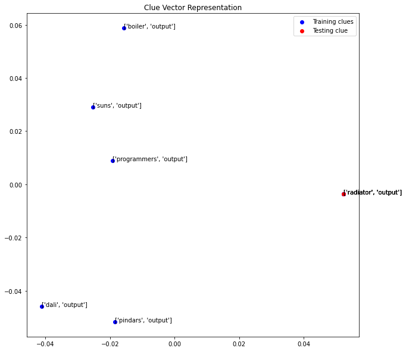
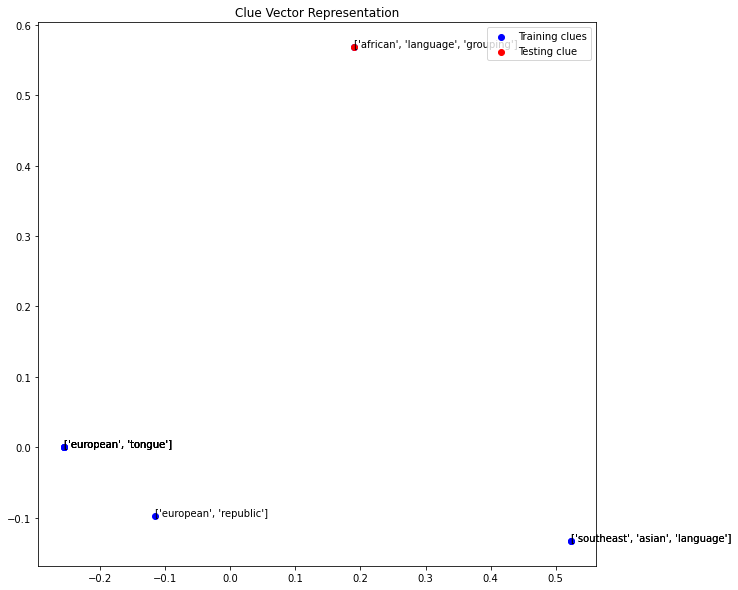
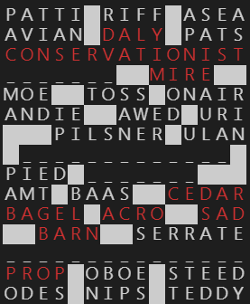

# CMSC 470 Final Project Writeup
Russell Schwartz, Chenqi Zhu, Henrique Corte, Ben Tompkins, Dan Song
11/15/21


## Project Overview
As a reminder, the goal of our project is to build an automatic crossword puzzle solver, trained on a data set of ~14,500 New York Times crosswords dating back to 1976.

The tentative name for the solver is **"Shortz Circuit"**.

Our progress so far includes
 - some statistical analysis of the data set
 - a working TF-IDF based guesser implementation
 - a working Word2Vec based guesser implementation
 - a clean framework for that includes the classes `Puzzle`, `Guesser`, and `Solver`
 - two naive `Solver` implementations (that actually aren't half bad)


## Data Set Statistics
 - Puzzles Available: 14545
 - Top 20 Most Common Answers:
    ```
    [('AREA', 896),
    ('ERA', 883),
    ('ERIE', 819),
    ('ERE', 750),
    ('ALOE', 723),
    ('ONE', 703),
    ('ARIA', 684),
    ('ORE', 679),
    ('ALE', 665),
    ('ANTE', 658),
    ('EDEN', 652),
    ('ATE', 651),
    ('ELI', 645),
    ('ENE', 632),
    ('ELSE', 624),
    ('ARE', 610),
    ('ETA', 595),
    ('ERR', 589),
    ('ALI', 585),
    ('SPA', 576)]
    ```
 - Does Zipf's Law Apply? Yup.





 - What proportion of the answers are English n-grams?
   ```python
   def is_english_ngram(string, n):
      if n == "":
         return False
      elif n == 1:
         return string in ENGLISH_WORDS
      
      for i in range(1, len(string) - 1):
         head, tail = string[:i], string[i:]
         if is_english_ngram(head, 1) and is_english_ngram(tail, n-1):
               return True
      
      return False


   total_clues = sum(answer_freqs.values())
   ngram_counts = [0] * 3

   for a in answer_freqs:
      for n in range(1, 4):
         if is_english_ngram(a, n):
               ngram_counts[n-1] += answer_freqs[a]
               break

   for n in range(1, 4):
      print(f"Percentage of answers that are english {n}-grams: {ngram_counts[n-1]/total_clues:0.3%}")

   print(f"Total: {sum(ngram_counts)/total_clues:0.3%}")
   ```
   ```
   Percentage of answers that are english 1-grams: 56.006%
   Percentage of answers that are english 2-grams: 23.864%
   Percentage of answers that are english 3-grams: 6.830%
   ```


## Guesser Implementations
The `guess` function should take as input the clue and the current contents of the slot and then generate a set of guesses which fit the slot and each have an associated confidence score. Our current implementation uses vanilla TF-IDF trained on a huge number of clues (602,694). 

When given a test clue, we find the `k` clues that are most similar (experimenting with both cosine similarity and L2-norm) and then filter for those that are compatible with the slot. Then, we use the similarity scores combined with the presence of repeats to calculate confidence scores. This looks like (from a `Guesser` class):

```python
@staticmethod
def distance_to_confidence(dist):
   """map a clue embedding vector distance to a confidence value"""
   return 0.5 * math.e ** (-dist)

@lru_cache(maxsize=10**3)
def guess(self, clue: str, slot: str, max_guesses: int=5) -> List[Tuple[str, float]]:
   clue_vector = self.vectorizer.transform([clue])

   # if clue vector is all 0's, we have never seen any of the words in the clue before
   # so we cannot even try to make a guess (yet)
   if clue_vector[0].nnz == 0:
      # TODO: default to n-gram search or something
      return []
   
   distances, indices = self.model.kneighbors(clue_vector, n_neighbors=20)
   raw_guesses = [self.answers_train[i] for i in indices[0]]

   def valid(g):
      o = True
      if len(slot):
            o &= len(g) == len(slot)
      o &= g.lower() not in clue.lower()
      return o
   
   # convert distances to confidences
   guesses = [
      (g, self.distance_to_confidence(d))
      for g, d in zip(raw_guesses, distances[0]) if valid(g)
   ]

   # if a guess appears multiple times, interpret confidences as independent probabilities and combine
   unique_guesses = set(g for g, _ in guesses)
   guesses_combined = [
      (g, 1 - math.prod(1-conf for g_, conf in guesses if g_==g))
      for g in unique_guesses
   ]

   return list(sorted(guesses_combined, key=lambda item: item[1], reverse=True))
```

Crossword puzzles love to repeat clue-answer pairs so this approach actually works pretty well. On our test set, the correct answer appeared in the top 5 best guesses ~60% of the time.

If TFIDF does not return any guesses above a meager confidence threshold, then the guesser resorts to n-gram searching, where it simply tries to find any sequence of english words that fit the slot.


## Word2Vec Guesser Attempt
### Motivation
Word2Vec is a useful tool in NLP which maps each word to a vector based on its association with the documents. It is good at detecting the ‘similarity’ between different words as two similar words would result in two similar vectors in the n-dimensional vector space and vice versa. We initially believe this would be a good implementation of guesser as the clues are comprised of short sentences with fewer words than the quizzes we have learned throughout the semester. In theory, Word2Vec would be good at matching two similar clues together by calculating the closeness (cosine similarity) between 2 vectors.

Gensim is a library containing a good implementation of Word2Vec trainer and various pre-trained models. We used modules from this library to train and test the Word2Vec guesser. As a clue has multiple words, we applied an average function `avg_feature_vector` on each clue to obtain the vector representation of each clue. The vectors could also be clustered using `KNearestNeighbors` method and the `guess` function utilizes this property to obtain the nearest n guesses fast. 

### Implementation
The following code defines the W2VGuesser class(Initializer, training, some utility functions are omitted to make the report concise):

```python
class W2VGuesser:
    # function average word2vec vector
    def avg_feature_vector(words, model, num_features, ind2key_set):
        feature_vec = np.zeros((num_features, ), dtype='float32')
        n_words = 0
        for word in words:
            if word in ind2key_set:
                n_words += 1
                feature_vec = np.add(feature_vec, model[word])
        if (n_words > 0):
            feature_vec = np.divide(feature_vec, n_words)
        return feature_vec

    # define cosine similarity score
    def sim_score(v1,v2):
        return 1 - spatial.distance.cosine(v1, v2)

    def guess(self, clue: str, slot: str, max_guesses: int=5) -> List[Tuple[str, float]]:
        clue = clue.replace('\'', '')
        clue = clue.replace('"', '')
        clue = clue.replace(':', '')
        clue_vector =  self.word2vec_vectorizer([clue],self.model,self.dim,set(self.model.index_to_key))
        distances, indices = self.nn_model.kneighbors(clue_vector,n_neighbors=max_guesses)
        raw_guesses = [self.answers[i] for i in indices[0]]

        def valid(g):
            o = True
            o &= len(g) == len(slot)
            o &= g.lower() not in clue.lower()
            return o
    
        # convert distances to confidences
        guesses = [
            (g, self.distance_to_confidence(d))
            for g, d in zip(raw_guesses, distances[0]) if valid(g)
        ]

        # if a guess appears multiple times, interpret confidences as independent probabilities and combine
        unique_guesses = set(g for g, _ in guesses)
        guesses_combined = [
            (g, 1 - math.prod(1-conf for g_, conf in guesses if g_==g))
            for g in unique_guesses
        ]

        return list(sorted(guesses_combined, key=lambda item: item[1], reverse=True))
```
### Visualization
As word vectors lives in n-dimensional vector space, it is possible to project each vector onto 2-dimensional plane to observe the closeness between different vectorized clues. To project a vector of higher dimension to a lower dimension space, one common method is Principal Component Analysis (PCA). PCA employs Singular Value Decomposition (SVD) to extract the m-dimensional data from n-dimensional data(n>m) by preserving data corresponding to m-largest singular values.



In this example where the testing clue was ‘radiator output’, the Word2Vec guesser successfully distinguished the testing data that matched to the clue (labeled red) with other confusing puzzles(blue) that also include the word ‘output’. We can see under the PCA the correct clue vector is not aligned with the incorrect ones on the x-axis.



While the Word2Vec guesser may be effective at distinguishing the wrong clues, in some other cases it was not able to find the correct one. This example above illustrates that despite the guesser separating ‘African language group’ from other culture-language related confusing clues it did not find any correct vector close to the testing clue.

#
The result of this attempt, however, was less than ideal. The Word2Vec implementation of guesser only achieved an accuracy of roughly 45% compared to what we had for 55% in the baseline guesser. It is possible that in the crossword puzzle, the same answer was asked in completely different way resulting in the vector being far from each other.


## Framework
The `Puzzle` class makes it really easy to interact with a crossword puzzle, which is nontrivial since the slot-identifier scheme is idiosyncratic. There are also lots of helper functions for visualizing a puzzle in the terminal while it is being solved. 

```
ＰＡＴＴＩ██ＲＩＦＦ██ＡＳＥＡ
ＡＶＩＡＮ██ＤＡＬＹ██ＰＡＴＳ
ＣＯＮＳＥＲＶＡＴＩＯＮＩＳＴ
＿＿＿＿＿＿＿████ＭＩＲＥ████
ＭＯＥ████ＴＯＳＳ██ＯＮＡＩＲ
ＡＮＤＩＥ████ＡＷＥＤ██ＵＲＩ
██████ＰＩＬＳＮＥＲ██ＵＬＡＮ
██＿＿＿＿＿＿＿＿＿＿＿＿＿██
ＰＩＥＤ██＿＿＿＿＿＿＿██████
ＡＭＴ██ＢＡＡＳ████ＣＥＤＡＲ
ＢＡＧＥＬ██ＡＣＲＯ████ＳＡＤ
████ＢＡＲＮ████ＳＥＲＲＡＴＥ
＿＿＿＿＿＿＿＿＿＿＿＿＿＿＿
ＰＲＯＰ██ＯＢＯＥ██ＳＴＥＥＤ
ＯＤＥＳ██ＮＩＰＳ██ＴＥＤＤＹ
```

We use double-wide unicode chars to make it print out a bit nicer. It is also color coded if your terminal supports the proper ANSI escape codes:



The `Guesser` and `Solver` classes encapsulate the necessary functionality including loading the model(s) from disk. A `Guesser` implements a `guess` function with the following signature:
```python
@lru_cache(maxsize=10**3)
def guess(self, clue: str, slot: str, max_guesses: int=5) -> List[Tuple[str, float]]:
   """Get a list of guesses represented as `(guess, confidence)` pairs (sorted best to worst)"""
```


## Solution Attempts
A relatively naive solution:

```python
class BasicSolverThreshold(Solver):
    """
    A variant of `BasicSolver`:

    Only fill in a slot if the guess confidence is above a threshold, which decreases over with time.

    Run until threshold hits a minimum degeneracy point (say, 5% confidence)
    """

    guesser_class: Type[Guesser] = BasicGuesser

    def solve(self, puzzle: Puzzle) -> bool:
        threshold = 0.75    # on the first pass, only fill in those that we are quite confident in

        while not puzzle.grid_filled() and threshold >= 0.05:
            stuck = True
            for ident in puzzle.get_identifiers():
                current_slot = puzzle.read_slot(ident)
                if " " not in current_slot: continue

                clue = puzzle.get_clue(ident)
                gs = self.guesser.guess(clue, puzzle.read_slot(ident), max_guesses=5)

                for g, conf in gs:
                    if compatible(current_slot, g) and conf >= threshold:
                        puzzle.write_slot(ident, g)
                        stuck = False
                        break
            
            threshold *= 0.5    # exponential decay
        
        return not stuck
```

This algorithm has the highly restrictive property that they solve the puzzle "in ink" so to speak, meaning that once a slot is written to it is never changed. Despite being really dumb, they actually work alright.

Here are some performance metrics for a test suite of 100 randomly chosen test puzzles.
```
{'average_fill_accuracy': 0.606,
 'average_fill_percentage': 0.745,
 'solver': <class 'solvers.BasicSolverThreshold'>}
```

`average_fill_accuracy` represents the percentage of filled cells that were correct

`average_fill_percentage` represents the percentage of the grid that was filled at all (at present, these solvers leave a slot blank if they have never seen any of the words in the clue before)


A smarter solution:

```python

class CellConfidenceSolver(Solver):
    """
    A first attempt at solving "in pencil".
    
    Each filled cell has associated confidence score (derived from guess confidence).
    Low confidence cells can be overwritten by subsequent guesses.
    """

    guesser_class: Type[Guesser] = HybridGuesser

    def solve(self, puzzle: Puzzle):
        self.confidence_grid = [
            [None if cell == "." else 0.0 for cell in row]
            for row in puzzle.grid
        ]

        conf_threshold = 0.90

        converged = False
        while not converged:
            converged = True
            for ident in puzzle.get_identifiers():
                current_slot = puzzle.read_slot(ident)
                slot_coords = puzzle.cells_map[ident]
                slot_confidence_avg = average(self.confidence_grid[y][x] for x, y in slot_coords)

                clue = puzzle.get_clue(ident)
                gs = self.guesser.guess(clue, puzzle.read_slot(ident), max_guesses=5)

                for g, conf in gs:
                    slot_confidence_avg_changed = average(
                        self.confidence_grid[y][x]
                        for (x, y), old, new in zip(slot_coords, current_slot, g)
                        if old != new
                    )
                    # overwrite the current slot if several conditions are met
                    if all([
                        g != current_slot,
                        conf > conf_threshold,
                        conf > slot_confidence_avg_changed + EPSILON,
                    ]):
                        # transfer guess confidence to cell confidence
                        for (x, y), old, new in zip(slot_coords, current_slot, g):
                            if old != new:
                                self.confidence_grid[y][x] = conf                               # cell contradicted
                            else:
                                old_conf = self.confidence_grid[y][x]
                                self.confidence_grid[y][x] = 1 - (1 - old_conf)*(1 - conf)      # cell corroborated
                        
                        # overwrite contents of slot with the new guess
                        puzzle.write_slot(ident, g)
                        
                        converged = False
                        break
            
            conf_threshold *= 0.5   # exponential decay
```

This solver works by maintaining a grid of confidence values (one for each cell). For example:


Confidence in a cell is inherited from the confidence in the guess. Confidence values can be increased or decreased through corroboration or contradiction. In the case that a cell with confidence  is corroborated by a new guess with confidence , we update according to the following rule:

(1-c')) 

Which corresponds to ) if we interpret confidence scores as independent probabilities.

Performance metrics:

```
{'average_fill_accuracy': 0.704,
 'average_fill_percentage': 0.934,
 'solver': <class 'solvers.CellConfidenceSolver'>}
```


## What's Next?
- Improvements to the guesser
    - a neural encoder model
    - specific modules for types of clues (e.g. fill-in-the-blank)
- Improvements to the solver
    - use a tree-search for finding locally consistent fills
    - refine notion of cell confidence
