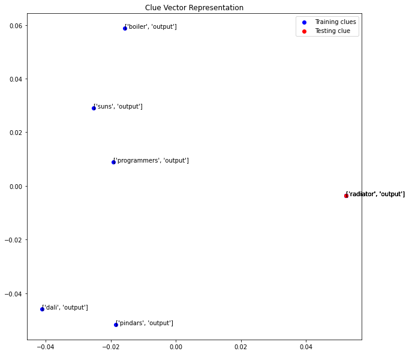

# CMSC 470 Final Project: Shortz Circuit
Russell Schwartz, Chenqi Zhu, Henrique Corte, Ben Tompkins, Daniel Song

Note: Word limit was exceeded to address the Gradescope accuracy issue.

## Project Overview
The goal of our project is to build an automatic crossword puzzle solver, trained on a data set of ~14,500 New York Times crosswords dating back to 1976.
We used two separate implementations to get our solver to work: A guesser, and a solver.

## Framework
The `Puzzle` class makes it easy to interact with a crossword puzzle, which is nontrivial since the slot-identifier scheme is idiosyncratic. There are also lots of helper functions for visualizing a puzzle in the terminal while it is being solved. 


## Guesser Implementations
The `guess` function should take as input the clue and the current contents of the slot and then generate a set of guesses which fit the slot, and each have an associated confidence score. Our current implementation uses vanilla TF-IDF trained on a huge number of clues (602,694). 

When given a test clue, we find the `k` clues that are most similar (experimenting with both cosine similarity and L2-norm) and then filter for those that are compatible with the slot. Then, we use the similarity scores combined with the presence of repeats to calculate confidence scores. This looks like (from a `Guesser` class):

### TF-IDF
Crossword puzzles love to repeat clue-answer pairs, so this approach works well. On our test set, the correct answer appeared in the top 5 best guesses ~60% of the time.

If TFIDF does not return any guesses above a meager confidence threshold, then the guesser resorts to n-gram searching, where it simply tries to find any sequence of English words that fit the slot.

Here is our TF-IDF Guesser Implementation:
```python
@lru_cache(maxsize=10**3)
def tfidf_guess(self, clue, slot_length):
    clue_vector = self.vectorizer.transform([clue])

    if clue_vector[0].nnz == 0:
        return []
    
    distances, indices = self.model.kneighbors(clue_vector, n_neighbors=20)
    raw_guesses = [self.answers_train[i] for i in indices[0]]

    def valid(g):
        o = True
        if slot_length:
            o &= len(g) == slot_length
        o &= g.lower() not in clue.lower()
        return o
    
    guesses = [
        (g, self.distance_to_confidence(d))
        for g, d in zip(raw_guesses, distances[0]) if valid(g)
    ]

    unique_guesses = set(g for g, _ in guesses)
    guesses_combined = [
        (g, 1 - product(1-conf for g_, conf in guesses if g_==g))
        for g in unique_guesses
    ]

    return list(sorted(guesses_combined, key=lambda item: item[1], reverse=True))
```

### Word2Vec Guesser Attempt
Word2Vec is a useful tool in NLP which maps each word to a vector based on its association with the documents. It is good at detecting the ‘similarity’ between different words as two similar words would result in two similar vectors in the n-dimensional vector space and vice versa. We initially believe this would be a good implementation of guesser as the clues are comprised of short sentences with fewer words than the quizzes we have learned throughout the semester. In theory, Word2Vec would be good at matching two similar clues together by calculating the closeness (cosine similarity) between 2 vectors.

Gensim is a library containing a good implementation of Word2Vec trainer and various pre-trained models. We used modules from this library to train and test the Word2Vec guesser. As a clue has multiple words, we applied an average function `avg_feature_vector` on each clue to obtain the vector representation of each clue. The vectors could also be clustered using `KNearestNeighbors` method and the `guess` function utilizes this property to obtain the nearest n guesses fast. 

The following code defines the W2VGuesser guess functionS:

```python
def avg_feature_vector(words, model, num_features, ind2key_set):
    feature_vec = np.zeros((num_features, ), dtype='float32')
    n_words = 0
    for word in words:
        if word in ind2key_set:
            n_words += 1
            feature_vec = np.add(feature_vec, model[word])
    if (n_words > 0):
        feature_vec = np.divide(feature_vec, n_words)
    return feature_vec

def guess(self, clue: str, slot: str, max_guesses: int=5) -> List[Tuple[str, float]]:
    clue = clue.replace('\'', '')
    clue = clue.replace('"', '')
    clue = clue.replace(':', '')
    clue_vector =  self.word2vec_vectorizer([clue],self.model,self.dim,set(self.model.index_to_key))
    distances, indices = self.nn_model.kneighbors(clue_vector,n_neighbors=max_guesses)
    raw_guesses = [self.answers[i] for i in indices[0]]

    def valid(g):
        o = True
        o &= len(g) == len(slot)
        o &= g.lower() not in clue.lower()
        return o

    guesses = [
        (g, self.distance_to_confidence(d))
        for g, d in zip(raw_guesses, distances[0]) if valid(g)
    ]

    unique_guesses = set(g for g, _ in guesses)
    guesses_combined = [
        (g, 1 - math.prod(1-conf for g_, conf in guesses if g_==g))
        for g in unique_guesses
    ]

    return list(sorted(guesses_combined, key=lambda item: item[1], reverse=True))
```
As word vectors lives in n-dimensional vector space, it is possible to project each vector onto 2-dimensional plane to observe the closeness between different vectorized clues. To project a vector of higher dimension to a lower dimension space, one common method is Principal Component Analysis (PCA). PCA employs Singular Value Decomposition (SVD) to extract the m-dimensional data from n-dimensional data(n$\geq$m) by preserving data corresponding to m-largest singular values.



In this example where the testing clue was ‘radiator output’, the Word2Vec guesser successfully distinguished the testing data that matched to the clue (labeled red) with other confusing puzzles(blue) that also include the word ‘output’. We can see under the PCA the correct clue vector is not aligned with the incorrect ones on the x-axis.


While the Word2Vec guesser may be effective at distinguishing the wrong clues, in some other cases it was not able to find the correct one. This example above illustrates that despite the guesser separating ‘African language group’ from other culture-language related confusing clues it did not find any correct vector close to the testing clue.

The result of this attempt, however, was less than ideal. The Word2Vec implementation of guesser only achieved an accuracy of roughly 45% compared to what we had for 55% in the baseline guesser. It is possible that in the crossword puzzle, the same answer was asked in completely different way resulting in the vector being far from each other.

### ELMo Attempt

We decided to try ELMo word embeddings to generate a more powerful representation of the clues for the word puzzles. We believed that these embeddings would be able to represent clues significantly better and boost our overall performance.

For our implementation, we used: 
1. We used AllenNLP’s pretrained ELMo model to generate word embeddings for our 800,000+ training samples. 
2. We ran into the problem of different dimensionality for clues of different lengths, so we used the same approach as DANS and averaged the ELMo embeddings for each clue.
3. Finally, we ran the average embeddings through a nearest neighbor model.

From running the average ELMo embeddings through Nearest Neighbors, we were able to achieve about 60% accuracy. This was roughly a 6-7% improvement on our previous TF-IDF model.
How could we improve this model?
we believe our accuracy was only 60% because the Nearest Neighbor model was not powerful enough to capture a lot of the differences in clues.
Next steps:
We believe that using a neural model would significantly improve our accuracy, more specifically a deep averaging network.
We were not able to do this due to lack of computation power, 860,000 samples and each embedding having 1000+ dimensions.


#
In the end, we decided to go with TF-IDF as our final guesser. While this was our baseline, the other models did not significantly improve accuracy, but instead greatly increased overhead in encoding and training. In the end we get around 60-70% accuracy for the TF-IDF guesser.


## Solver Implementations
A relatively naive solution:

```python
class BasicSolverThreshold(Solver):
    """
    Only fill in a slot if the guess confidence is above a threshold, which decreases over with time.
    Run until threshold hits a minimum degeneracy point (say, 5% confidence)
    """

    guesser_class: Type[Guesser] = BasicGuesser

    def solve(self, puzzle: Puzzle) -> bool:
        threshold = 0.75 

        while not puzzle.grid_filled() and threshold >= 0.05:
            stuck = True
            for ident in puzzle.get_identifiers():
                current_slot = puzzle.read_slot(ident)
                if " " not in current_slot: continue

                clue = puzzle.get_clue(ident)
                gs = self.guesser.guess(clue, puzzle.read_slot(ident), max_guesses=5)

                for g, conf in gs:
                    if compatible(current_slot, g) and conf >= threshold:
                        puzzle.write_slot(ident, g)
                        stuck = False
                        break
            
            threshold *= 0.5
        
        return not stuck
```

This algorithm has the highly restrictive property that they solve the puzzle "in ink" so to speak, meaning that once a slot is written to it is never changed. Despite being dumb, they work alright.

Here are some performance metrics for a test suite of 100 randomly chosen test puzzles.
```
{'average_fill_accuracy': 0.606,
 'average_fill_percentage': 0.745,
 'solver': <class 'solvers.BasicSolverThreshold'>}
```

`average_fill_accuracy` represents the percentage of filled cells that were correct

`average_fill_percentage` represents the percentage of the grid that was filled at all (at present, these solvers leave a slot blank if they have never seen any of the words in the clue before)


A smarter solution:

```python

class CellConfidenceSolver(Solver):
    """
    Each filled cell has associated confidence score (derived from guess confidence).
    Low confidence cells can be overwritten by subsequent guesses.
    """

    guesser_class: Type[Guesser] = HybridGuesser

    def solve(self, puzzle: Puzzle):
        self.confidence_grid = [
            [None if cell == "." else 0.0 for cell in row]
            for row in puzzle.grid
        ]

        conf_threshold = 0.90

        converged = False
        while not converged:
            converged = True
            for ident in puzzle.get_identifiers():
                current_slot = puzzle.read_slot(ident)
                slot_coords = puzzle.cells_map[ident]
                slot_confidence_avg = average(self.confidence_grid[y][x] for x, y in slot_coords)

                clue = puzzle.get_clue(ident)
                gs = self.guesser.guess(clue, puzzle.read_slot(ident), max_guesses=5)

                for g, conf in gs:
                    slot_confidence_avg_changed = average(
                        self.confidence_grid[y][x]
                        for (x, y), old, new in zip(slot_coords, current_slot, g)
                        if old != new
                    )
                    # overwrite the current slot if several conditions are met
                    if all([
                        g != current_slot,
                        conf > conf_threshold,
                        conf > slot_confidence_avg_changed + EPSILON,
                    ]):
                        # transfer guess confidence to cell confidence
                        for (x, y), old, new in zip(slot_coords, current_slot, g):
                            if old != new:
                                self.confidence_grid[y][x] = conf                               # cell contradicted
                            else:
                                old_conf = self.confidence_grid[y][x]
                                self.confidence_grid[y][x] = 1 - (1 - old_conf)*(1 - conf)      # cell corroborated
                        
                        # overwrite contents of slot with the new guess
                        puzzle.write_slot(ident, g)
                        
                        converged = False
                        break
            
            conf_threshold *= 0.5   # exponential decay
```

This solver works by maintaining a grid of confidence values (one for each cell). For example:


Confidence in a cell is inherited from the confidence in the guess. Confidence values can be increased or decreased through corroboration or contradiction. In the case that a cell with confidence $c$ is corroborated by a new guess with confidence $c'$, we update according to the following rule:

$$c \gets 1 - (1 - c)(1 - c')$$

Which corresponds to $\mathrm{Prob}(c \lor c')$ if we interpret confidence scores as independent probabilities.

Performance metrics:

```
{'average_fill_accuracy': 0.704,
 'average_fill_percentage': 0.934,
 'solver': <class 'solvers.CellConfidenceSolver'>}
```

With these metrics, we believe our model and techniques for guessing and solving to work. While we never reached the gold-standard of 94%, we reached to around 70% just using TF-IDF and leveraging cell confidences.
These are great results that dont require an extreme amount of overhead to build encodings and teach models. 

## Error Analysis
### Effects of Question Type
In NYT Crossword puzzles, there are 4 forms of clues: Questions, Fill-in-the-Blank, Clues with Specifiers, and General Clues. **Questions** usually come in the form of jokes, puns, or sayings
(i.e., Go for the gold? -> Pan, Win; where the first word is correct, second is our model's guess). **Fill-in-the-blank** is self-explanatory (i.e., ___-la-la -> Ooh, Tra). Next are clues with specifiers, where the clue ends with a categorical hint in parentheses (i.e., Pizzeria ___ (fast-food chain) -> UNO, KFC).
Lastly are general clues, which are clues that usually ask for synonyms or related terms (i.e., Cell, e.g. -> Phone, Pager)

A potential issue with some of the clues is the model may not be aware of the different types and their rules. For instance, the model will see “Look ___ (probe)” and guess “Test.” Here the model sees “probe” and a good four-letter word that matches is “test”. However, the model is unaware that “___” means that the guessed word belongs in this context. So in actuality, the answer is “Into.”

This also goes for question clues that require a little more real-knowledge and cleverness that our tf-idf models may fail to see.


Based on a sample of 100 random crosswords, our system had the most success answering Fill-in-the-Blank clues along with mild success with specifier clues.
Our models had the most problems guessing clues with questions. This makes sense as these clues require the most real-world knowledge as they are often jokes, puns, or fairly ambiguous. 
In the future, we suggest leveraging a model that can work around these real-world dependencies for more accurate guesses.

### Slot and Clue Length

Other findings in the error analysis looked at the slot and clue length and seeing if these number impacted accuracy. We found that slot length does not affect the accuracy of the guess; incorrect guesses did not skew longer/shorter than correct guesses. Both correct guesses and incorrect guesses averaged to a little over 4. 
However, we also found that clue length does affect the accuracy of the guess. Longer clues lead to more inaccurate results. This makes sense as longer clues usually means more words for the model to get distracted with. Also, in longer clues there is more of a probability that the clue contains a word that the model has never seen before.

## Gradescope Error Analysis
Regarding our Gradescope submission, the accuracy came up as zero. It would be a reasonable expectation that there would be some transferability for a tf-idf guesser trained on crossword data to deliver very small but nonzero accuracy on quiz bowl data. This expectation is based on the assumption there should be some intersection between Quiz Bowl question-answers and Crossword clue-answers. This isn't the case because the Quiz Bowl and Crossword data is structured very differently. 

In terms the dissimilarity of questions between the two datasets, Quiz Bowl questions are long and detailed full paragraphs and sentences, and the logic connecting Quiz bowl questions to answers is straightforward. Clues are one to four word phrases that are meant to be cryptic (otherwise, solving crossword puzzles would be too easy) and require subtle logic or logic very specific to crossword puzzles to connect the answers to the clues. Also, crossword questions often have fill-in-the-blank lines that aren't present in quiz bowl questions.

Regarding the answers of both datasets, the Quiz Bowl answers are usually derivable from one or more Wikipedia pages, but crossword answers are usually pulled from marginal types of knowledge that Wikipedia likely wouldn't consider but would need to be found with a thorough Google search or are exclusively found in crossword clue-answer archives.

In terms of answer format, Quiz Bowl answers are well-spaced and coherent. Crossword guesses draw from extremely limited vocab compared to Quiz Bowl data due to the brevity of crossword clues and answers. Crossword guesses also have to deal with an unconventional additional constraint, the length of the answer that can fit in an arbitrary crossword puzzle space (this guess length is denoted by the `slot` parameter, where the length of a whitespace string corresponds to guess length).  Crossword answers are concatenated into one word, so in their default form, they are not present in Wikipedia for concatenated multi-word answers. One could use a parser to parse concatenated words into separate words, but there might different viable ways to parse concatenated words into valid English words, so there is information lost in the concatenation. This is why Wikipedia coercion didn't work well.

Our tf-idf guesser is robust to clue-answer data, but this doesn't transfer to Quiz Bowl data due to the differences in the datasets. This is evident from the fact that we received a non-zero accuracy (50-70%) in running our tf-idf guesser on crossword data that is presented in our uploaded video. If our tf-idf guesser trained on crossword data was inherently flawed, it would produce zero accuracy on both Quiz Bowl and Crossword data. Outputs from `guessing_output.ipynb` for our tf-idf guesses on crossword clue-answers is shown in `outputs/guessing.ipynb.output`. This shows that our tf-idf guesser is working well for crossword test data. The outputs of running the tf-idf guesser on the `small.guessdev.json` in `outputs/compare.output` show the lack of transferability of a crossword-trained tf-idf guesser to Quiz Bowl data. 

The non-trivial differences between the Quiz Bowl question-answer data and the crossword clue-answer data causes high dissimilarity between question-answer vectors and the clue-answer vectors. This high dissimilarity significantly affects the transferability of a crossword-trained tf-idf guesser to Quiz Bowl data. 

Below are some examples of clue-answer-guesses in `outputs/guessing.ipynb.output` from the `guessing_output.ipynb` notebook that would have ambiguous correspondence to Quiz Bowl questions-answers and to Wikipedia articles.
```
clue: Gaze dreamily
answer: MOON
guesses: [('MOON', 0.0), ('MOON', 0.0), ('PEER', 0.8281459341378639), ('MUSE', 0.9316012626317816), ('SLIM', 1.0)]
----------------------------------------------
clue: Uses again, as Tupperware
answer: RESEALS
guesses: [('ALLOVER', 1.0), ('NOTONCE', 1.0)]
----------------------------------------------
clue: Stigma
answer: ODIUM
guesses: [('BRAND', 0.0), ('STAIN', 0.0), ('BRAND', 0.0), ('STAIN', 0.0), ('BRAND', 0.0)]
```

Running `python3 ./compare.py` will produce the results below.

Here are some examples of question-answer-guesses in `outputs/compare.output` that show our crossword tf-idf doesn't transfer well, if at all, to Quiz Bowl. Our tf-idf guesser depends on a `slot` parameter that tells the available length of the crossword answer. I set this `slot` parameter to be the length of the quiz bowl answer with whitespace removed. However, there are often supplementary details to a quiz bowl answer such as `spin angular momentum [prompt on "angular momentum" before mention]`, which confused the `slot` parameter of how long the guess should be. The `slot` parameter, high structural differences in data and the lack of intersection between quiz bowl question-answer's and crossword clue-answer's results in very little transferability of a crossword-trained tf-idf guesser to quiz bowl data.

Similar results were found if I used the first question rather than the entire question.

```
--------------------------------------------------------------------
question:  Along with orbitons and holons, quasiparticles carrying this property are formed from electrons in Luttinger liquids, which carry density waves in charge and this property. Similar wave-like disturbances in the collective structure of this property for a crystal lattice are quantized into magnons. This property separates orthohydrogen from parahydrogen, and its total value is 0 for singlet states and 1 for triplet states. This property causes a beam of silver atoms sent through an inhomogeneous magnetic field to split into two beams instead of forming a continuous band. This property, described by a set of Hermitian unitary matrices named for Wolfgang Pauli, was discovered in the Stern-Gerlach experiment. For 10 points, name this intrinsic form of angular momentum, whose quantum number can be plus or minus one-half for electrons.
answer:  spin angular momentum [prompt on "angular momentum" before mention]
crossword_tfidf guess:  []
--------------------------------------------------------------------
question:  By processing one etching through four stages, this artist created a curtain of light that illuminates the good thief but casts the bad thief in shadow, as part of one of his best known drypoints. This artist included a hazily rendered flute player in the background of a work whose title figure wears a twelve-pointed black broach on his golden cloak, has a crown above his turban, and knocks over a chalice in shock. That painting by this artist of The Three Crosses shows a hand emerging out of a smoke to show golden Hebrew letters illuminated on the wall. A large textbook is propped open in the corner of a painting by this man in which the corpse of Aris Kindt is being studied by Nicolaes Tulp. For 10 points, name this Dutch Baroque painter of Belshazzar's Feast, The Anatomy Lesson, and the massive Night Watch.
answer:  Rembrandt Harmenszoon van Rijn
ngram guess: ONWARDTETRAIODOPHENOLPHTHALEIN
crossword_tfidf guess:  [('ONWARDTETRAIODOPHENOLPHTHALEIN', 0.050001000000000004)]
--------------------------------------------------------------------
question:  This author describes the title event of one poem as a "heart's clarion" and "world's wildfire" and states that "this... poor potsherd, patch, matchwood… is Immortal Diamond." This author wrote a poem whose various interpretations center on the word "Buckle" and describes how "blue-bleak embers… Fall, gall themselves, and gash gold-vermillion." This author of "That Nature is a Heraclitean Fire and of the Comfort of the Resurrection" remembered "the Happy Memory of five Franciscan Nuns exiled by the Falk Laws," in a poem that plays on the name of a sunken ship to describe both the vessel and the country from which it departed. For 10 points, name this English Jesuit poet of "The Wreck of the Deutschland," who used sprung rhythm in "The Windhover."
answer:  Gerard Manley Hopkins
ngram guess: UNDISTINGUISHABLENESS
crossword_tfidf guess:  [('UNDISTINGUISHABLENESS', 0.050001000000000004)]
--------------------------------------------------------------------
question:  The dominant edition of this philosopher's works was revised in the 70s by P.H. Nidditch and first edited by Baronet L. A. Selby-Bigge. This man inspired "quasi-realism," a meta-ethical view formulated by Simon Blackburn. Elizabeth Anscombe's Intention rejected this thinker's two-component theory of motivation, in which a desire and a belief are the only things needed to produce action. This man's longest book claims that personal identity is a mere "bundle" of perceptions, and downplays the strength of reason in its second part, "Of Passions." This billiards enthusiast and secret atheist wrote that all ideas come from prior "impressions," except perhaps a spectrum's missing shade of blue. For 10 points, name this author of A Treatise of Human Nature, an 18th-century empiricist Scotsman.
answer:  David Hume
ngram guess: HYPOTHENAR
crossword_tfidf guess:  [('HYPOTHENAR', 0.050001000000000004)]
--------------------------------------------------------------------
question:  Horatio Parker won a prize commissioned by this city for his opera Fairyland. With Artie Mason Carter, Philadelphia's Christine Stevenson founded a musical venue in this city with the goal of performing "Symphonies Under the Stars." Mark Swed criticized the "tyranny of technology" in the form of large LED screens installed in one venue in this city. Bassist Charles Mingus was raised largely in this city, where the Finnish-born Esa-Pekka Salonen began conducting at age 27. The mirror-like walls of the Founders Room of a concert hall in this city originally produced dangerous blinding glare. Inexpensive classical music performances are given at a natural amphitheater in this city known as the Bowl. For 10 points, name this city home to the Frank Gehry-designed Walt Disney Concert Hall.
answer:  Los Angeles, California
ngram guess: FORMALDEHYDESULPHOXYLIC
crossword_tfidf guess:  [('FORMALDEHYDESULPHOXYLIC', 0.050001000000000004)]
--------------------------------------------------------------------
question:  One poem by this author describes an island "long unknown and yet far kinder than our own" that produces figs, melons, and pomegranates. This poet laments the practice of men carving their beloveds' names into trees in a poem that states "no white nor red was ever seen / so am'rous as this lovely green." Still another poem by this author of "Bermudas" praises a man who "ruin[ed] the great work of time" and "cast the kingdom old / into another mould." The speaker of a fourth poem by this author of "The Garden" declares, "I would / Love you ten years before the Flood / And you should, if you please, refuse / Till the conversion of the Jews." For 10 points, name this 17th-century British poet of "An Horatian Ode Upon Cromwell's Return from Ireland" and "To His Coy Mistress."
answer:  Andrew Marvell
ngram guess: CYLINDROOGIVAL
crossword_tfidf guess:  [('CYLINDROOGIVAL', 0.050001000000000004)]
--------------------------------------------------------------------
question:  A G minor piece by this composer begins with an ascending arpeggiated A-flat major chord beginning on C and played by both hands an octave apart, then transitions into 6/4 time to introduce the first theme. Towards the end of another of his pieces, the right hand rapidly and repeatedly plays C-flat, B-flat, C-natural, A before resolving into E-flat major chords, first broken, then blocked. This composer's posthumous Op. 72 includes a set of three brief écossaises. He proceeded via the circle of fifths through all the major and minor keys with his Op. 28 set of 24 standalone preludes. The third movement of his Piano Sonata No. 2 in B-flat minor is a well-known funeral march. For 10 points, name this Romantic pianist whose many mazurkas and polonaises built on traditional forms from his homeland, Poland.
answer:  Frederic Chopin
ngram guess: READVERTISEMENT
crossword_tfidf guess:  [('READVERTISEMENT', 0.050001000000000004)]
--------------------------------------------------------------------
```
## Who did what?
**Russell Schwartz**
- Worked on data collection, main framework, baseline TFIDF guesser, and solver algorithms.
- Found, processed, and cleaned data set
- Ran statistics on data set
- Wrote Puzzle, Guesser, and Solver classes
- Wrote testing and puzzle visualization utilities
- Implemented TF-IDF baseline
- Developed Threshold Solver Algorithm
- Developed Cell Confidence Solver Algorithm

**Henrique Corte**
- Due to the low accuracy from tf-idf and word2vec, I worked on implementing averaged ELMo embeddings to NN model.
- Error analysis of the ELMo model and analyzed what clue-pairs the model under performed for.
- Found ways to boost accuracy, including averaging the embeddings, batching training samples, cleaning test data, data selection to improve embedding speed and computational performance.
- Attempted to run these embeddings through different models, including logistic regression and deep networks - both of which were unsuccessful due to absurd computing time.

**Chenqi Zhu**
- Responsible for the Word2Vec representation of the clues. 
- Constructed W2VGuesser class and associated functions.
- Attempted using W2V as embedding in DAN but failed at making the model compatible with tensorflow.
- Visualization of Word2Vec using PCA and analysis on some examples.

**Ben Tompkins**
- Research and Development on the guesser, specifically the fallback when the guesser receives a clue where it doesn't recognize any of the worlds. 
  - Word2Word Generator model -> doesn't rely on having to see the words; provided good guesses but were incompatible and not the right length.
  - Wikipedia fallback that would look the clue up on Wikipedia if it didn't recognize the words -> This increased fill percentage but did not increase accuracy. 
  - Ended up going with n-gram implementation
- Error Analysis on the final model.

**Daniel Song**
- Worked on and tested final Guesser Implementation.
- Experimented with other pretrained model options through Huggingface and Transformers.
- Worked to make Crossword submission compatible with QA Gradescope submission.
- Helped with presentation slides, gradescope error analysis and training a pre-trained Word2Vec model on crossword data.
- Wrote up compare.py and guessing_output.ipynb to show the lack of transferability of a crossword-trained tf-idf to quiz bowl data.


